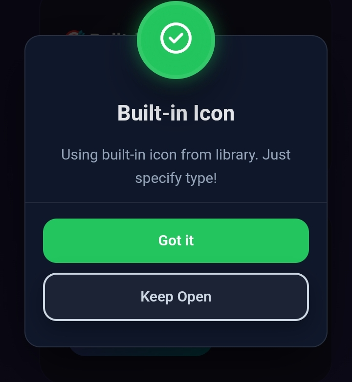
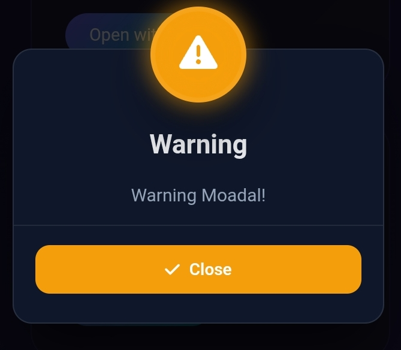
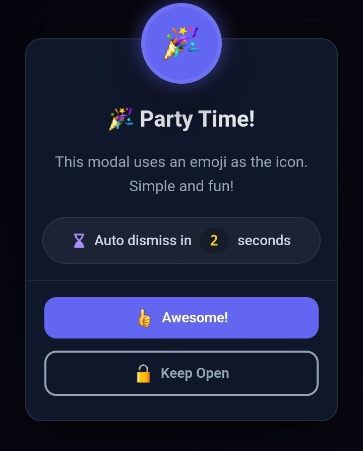

# 🎨 Ron Modern Modal

<p align="center">


</p>
<p align="center">
⚡ Ultra Modern Animated JavaScript Modal Library `<br> 💎
Premium UI • 🚀 Lightweight • 🎯 Powerful API
</p>

------------------------------------------------------------------------

## 🎬 Live Preview


<p align="center">

</p>

------------------------------------------------------------------------

# ✨ Why Ron Modern Modal ?

Ron Modal is built for **developers who want premium UI without heavy
frameworks.**

It provides:

-   🎨 Beautiful glassmorphism modal design
-   ⚡ Smooth spring animations
-   ⏳ Auto dismiss timer system
-   🔘 Smart action buttons
-   🎭 Multi‑format icon engine
-   📱 Fully responsive layout
-   🎯 Simple & clean API
-   🧠 Smart modal state handling
-   💎 Theme customization via CSS variables

------------------------------------------------------------------------

# 🚀 CDN Installation

``` html
<link rel="stylesheet" href="https://cdn.yoursite.com/ron-modal.css">
<script src="https://cdn.yoursite.com/ron-modal.js"></script>
```

Optional Font Awesome:

``` html
<link rel="stylesheet"
href="https://cdnjs.cloudflare.com/ajax/libs/font-awesome/6.4.0/css/all.min.css">
```

------------------------------------------------------------------------

# ⚡ Basic Usage

``` js
RonModal.show({
  type: "info",
  title: "Hello Developer 👋",
  message: "Ron Modern Modal is working!",
  icon: "🚀",
  temp: 5
});
```

------------------------------------------------------------------------

# 🎨 Icon Engine (Ultra Flexible)

Supports:

✅ Emoji\
✅ Font Awesome\
✅ Custom SVG\
✅ Built‑in Icons\
✅ Image URL

Example:

``` js
icon: "fa-solid fa-star"
icon: "🔥"
icon: `<svg>...</svg>`
icon: "https://site.com/icon.png"
```

------------------------------------------------------------------------

# 🎛 Advanced Modal Example

``` js
RonModal.show({
  type: "warning",
  title: "System Update",
  message: "New update available",
  icon: "⚠️",
  iconColor: "#fbbf24",
  iconBackground: "#1e293b",
  temp: 8,
  buttons: [
    {
      text: "Update Now",
      style: "success",
      icon: "✅",
      onClick: () => console.log("Updating")
    },
    {
      text: "Later",
      style: "outline",
      icon: "⏳",
      isKeepOpen: true
    }
  ]
});
```

------------------------------------------------------------------------

# ⏳ Auto Dismiss Timer

``` js
temp: 5
```

Modal will automatically close after countdown.

------------------------------------------------------------------------

# 🔒 Keep Modal Open

``` js
{
  text: "Keep Open",
  isKeepOpen: true
}
```

Stops timer instantly.

------------------------------------------------------------------------

# 🎬 Animation System

-   Fade overlay
-   Spring popup modal
-   Pulsing glow icon
-   Hover lift buttons

All controlled via CSS.

------------------------------------------------------------------------

# 🎨 Theme Customization

``` css
:root {
  --ron-modal-bg: #0f172a;
  --ron-modal-success: #22c55e;
  --ron-modal-danger: #ef4444;
  --ron-modal-shadow: 0 25px 50px rgba(0,0,0,0.6);
}
```

Create:

🌑 Dark Theme\
🌈 Gradient Theme\
💎 Glass Theme\
⚡ Neon Cyber Theme

------------------------------------------------------------------------

# 📱 Responsive Ready

-   Mobile optimized modal width
-   Adaptive button stacking
-   Smooth touch interactions

------------------------------------------------------------------------

# 🧠 API

### Show

``` js
RonModal.show(config)
```

### Close

``` js
RonModal.close()
```

### State

``` js
RonModal.isOpen()
```

------------------------------------------------------------------------

# 🧪 UX Examples

## ✅ Success Modal


## ⚠️ Warning Modal



## ⏳ Timer Modal



------------------------------------------------------------------------

# 👑 Philosophy

> Simple API --- Premium Experience

------------------------------------------------------------------------

# 📄 License

MIT License © Ron

------------------------------------------------------------------------

# ⭐ Support

If you like this project:

⭐ Star the repository\
🚀 Share with developers\
💎 Build amazing UI

Happy Coding 🔥
